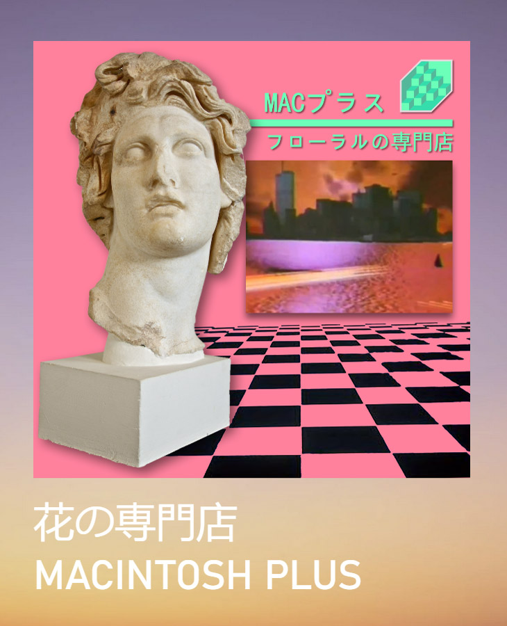
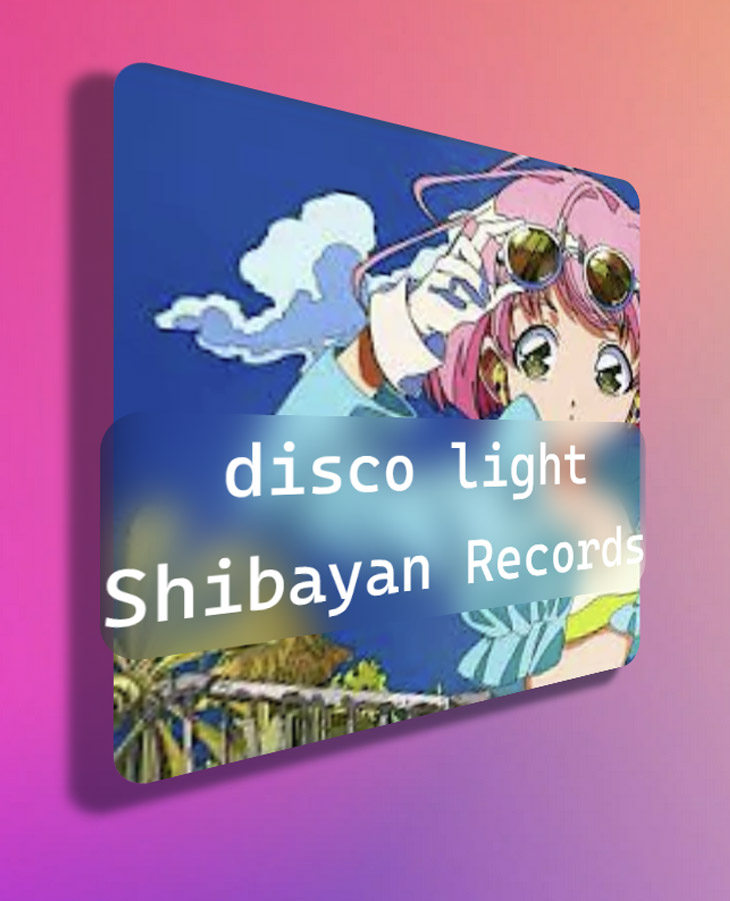

# np-widget

WIP Now Playing desktop widget using Tauri.

Download: check the [releases page](https://github.com/gyng/np-widget/releases).

|                                                       |                                                       |
| ----------------------------------------------------- | ----------------------------------------------------- |
|  |  |

## Features/support/limitations

- Svelte client
- (Only) Windows RT media API (Global System Media Transport Controls (GSMTC), [support](https://github.com/ModernFlyouts-Community/ModernFlyouts/blob/main/docs/GSMTC-Support-And-Popular-Apps.md))
- Draggable and resizable. Saves location and size.
- Priority list
- Primitive user CSS theming

## Theming

Insert your style sheet into the "Style override" textarea.

Eg, to turn images grayscale

```css
img {
  filter: grayscale(1);
}
```

## Feature ideas

- More widgets (CPU, memory, network, lyrics, spectrogram)
- Widget bundles (JS/HTML/CSS)
- Dynamic Svelte component loading

## Links

- https://rfdonnelly.github.io/posts/tauri-async-rust-process/#the-async-process
- https://github.com/Nerixyz/current-song2

## Development

> **Note**
> np-widget has to be built on Windows.

```sh
$ cargo tauri dev
$ cargo test
$ cargo clippy

# If needed; output is target/release/np.exe
$ cargo tauri build

# Run JS/client tests
$ (cd client; npm i; npm run test; npm run check)
$ npm run test:unit
$ npm run check:watch
```
