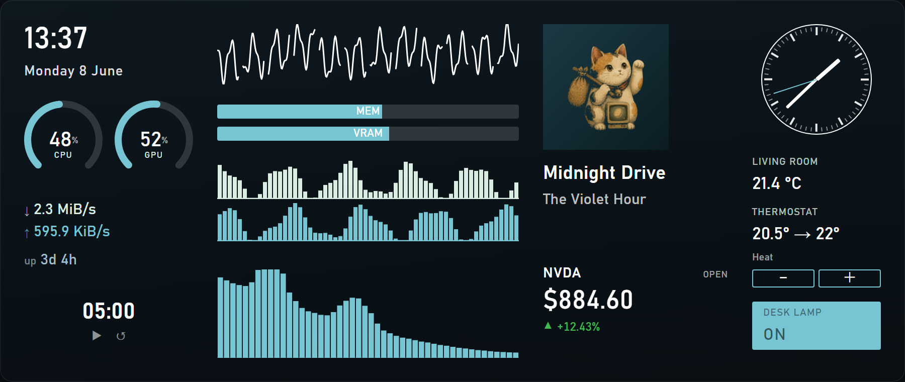
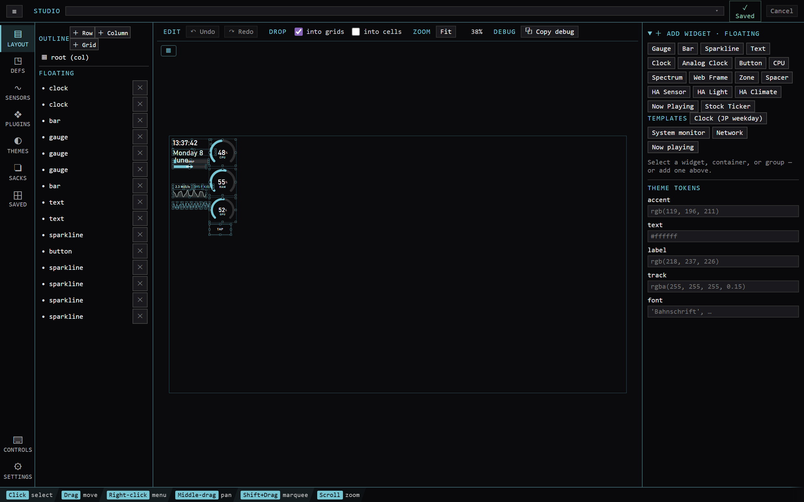

# widgetsack

<p align="center">
  
</p>

[**👉 .msi download for the latest release**](https://github.com/gyng/nowplaying-widget/releases/latest)

A themable desktop widget overlay for Windows.

Put system meters (CPU, per-core, GPU/VRAM, memory, network), clocks, and the currently-playing track on a transparent, click-through overlay across all your monitors and arrange them with a
built-in visual editor. Widgets follow a sensor + meter model but the layout is a live CSS-flow editor, styling is plain CSS + design
tokens, and it ships with Home Assistant, MQTT, and stock-quote integrations.

## Widget gallery

See: [**widget reference**](docs/widgets.md) · [**templating & formulas**](docs/templating.md)

The screenshots regenerate from the registry: `npm run gen:gallery` (in `client/`); both reference
docs regenerate from the code with `npm run gen:docs`.

## Layout studio

<p align="center">
  
</p>

## Features

- **Widgets:** gauges, bars, sparklines, text, digital + analog clocks, a per-core CPU grid, an
  audio spectrum, a now-playing card, a stock ticker, an application fence or zone, a web iframe, action buttons, and Home
  Assistant tiles — sensor- or [formula-driven](docs/templating.md) and fully restylable ([reference](docs/widgets.md)).
- **Sensors:** CPU (total/per-core/freq), memory + swap, network, disks, uptime, battery, and
  NVIDIA GPU (NVML) — demand-gated, so only what's on screen is sampled.
- **Now playing:** Windows media via GSMTC — Spotify, foobar2000, browsers, and more
  ([support table](https://github.com/ModernFlyouts-Community/ModernFlyouts/blob/main/docs/GSMTC-Support-And-Popular-Apps.md)).
- **Integrations:** Home Assistant (live states + light/climate controls), MQTT, and stock quotes.
- **Overlay:** transparent, click-through, always-on-top, one per monitor — per-widget
  click-through still lets buttons/controls catch clicks. Single-instance, optional autostart.
- **Studio:** visual editor — drag/resize/snap a CSS-flow layout, browse sensors, build reusable
  widgets, edit themes, import/export "sacks". `Ctrl+Alt+E`; live-reloaded `widgets.json`.
- **Templates:** one-click starter groups (clock, system, network, now-playing) recreated from
  classic Rainmeter skins.
- **Macros:** bind a button to a sequence of actions (HA service calls, media transport).
- **Theming:** per-widget CSS (highlighting/linting editor), design-token themes, system fonts.
- **Window zones:** define snap regions and drag any app's window into them.
- **Perfect for secondary and side monitors**: Corsair Xeneon Edge, Lamptron, Turzx, etc.
- Built with Tauri + React.

## Coming from Rainmeter?

widgetsack is a web-first take on what a widget suite does — system meters, clocks, now-playing, and a transparent always-on-top overlay — with a few differences:

- **Sensor + meter, not `.ini`:** the same measure→meter idea (a sensor feeds a meter), but you
  wire it in a visual **studio** instead of hand-editing config files. Layout is CSS flexbox and
  styling is plain per-widget CSS + design tokens.
- **Built-in skins as templates:** the bundled templates recreate classic skin layouts and drop in
  with one click; build your own reusable widgets in the widget designer.
- **Built-in sources:** beyond local system sensors, pull in Home Assistant, MQTT, and live stock
  quotes.
- **Layout containers**: Grids, rows, columns and floating widgets that use HTML and CSS for styling

## Usage

Download the installer msi from the [latest release](https://github.com/gyng/nowplaying-widget/releases/latest).

The overlay starts passive (click-through). To arrange widgets:

1. **Enter edit mode** — the tray icon's **"Edit layout"**, or press **`Ctrl+Alt+E`**.
2. Drag widgets to move, drag the handles to resize. Use the **palette** (bottom-left) to
   add widgets and the **inspector** to edit a selected widget's sensor / position / config.
3. **Exit edit mode** the same way. The layout saves to `widgets.json` (in the app config
   dir) and reloads automatically if you hand-edit that file.

### Theming

Each widget can take a CSS override. Eg, to turn images grayscale:

```css
img {
  filter: grayscale(1);
}
```

### Now playing — source priority

If multiple audio sources are active, a priority list of executable names decides which to
show (reachable in edit mode; "All media" lists the current sources).

### Autostart

Toggle autostart in settings, or add `widgetsack.exe` to Startup apps in Task Manager.

## TODO

- Desktop-pinned widget layer (behind windows, à la wallpaper engines)

## Development

Build/run instructions, the test gates, and the release process live in
[docs/development.md](docs/development.md). The architecture and roadmap are in
[docs/widget-platform.md](docs/widget-platform.md).

## License

Licensed under either of

- Apache License, Version 2.0 ([LICENSE-APACHE](LICENSE-APACHE) or
  <http://www.apache.org/licenses/LICENSE-2.0>)
- MIT license ([LICENSE-MIT](LICENSE-MIT) or <http://opensource.org/licenses/MIT>)

at your option.

Unless you explicitly state otherwise, any contribution intentionally submitted
for inclusion in the work by you, as defined in the Apache-2.0 license, shall be
dual licensed as above, without any additional terms or conditions.

<p align="center">
  
</p>
